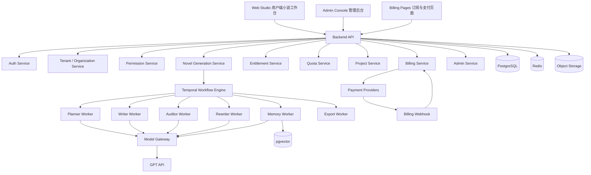
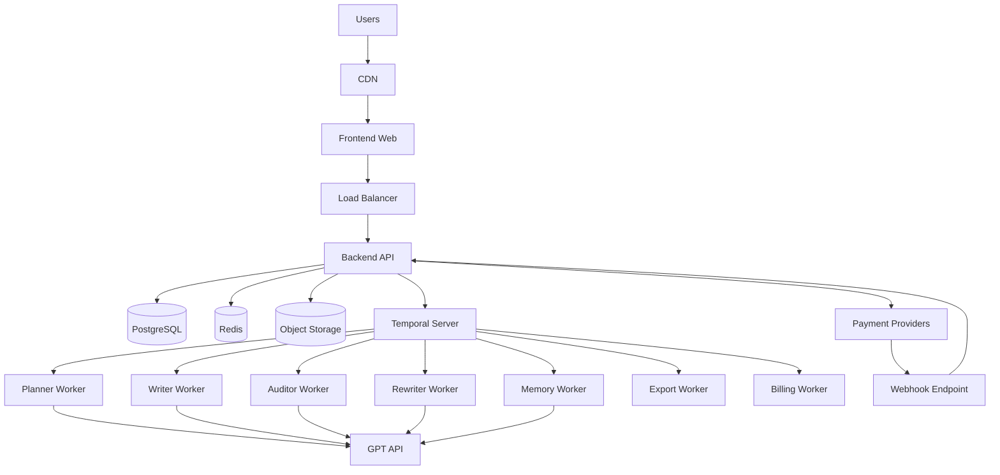

# AI 小说自动生产 SaaS 平台最终架构设计文档

**文档版本**：v1.0  
**项目定位**：面向长期商业化运营的 AI 小说自动生产平台  
**核心目标**：支持用户通过付费套餐获得自动写小说、自动审稿、自动重写、长期记忆、导出成书等能力。  
**推荐形态**：SaaS 多租户平台 + 自动小说生成工作流引擎 + 会员套餐/额度计量系统 + 管理后台。

---

## 1. 项目定位

本项目不是一个简单的 AI 写作工具，也不是一个聊天机器人前端，而是一个面向对外盈利的 **AI 小说自动生产 SaaS 平台**。

平台核心能力包括：

```text
用户输入题材/设定
→ 系统生成故事圣经
→ 系统生成世界观/人物/主线/支线
→ 系统生成全书大纲
→ 系统生成章节大纲
→ 系统拆分场景
→ 系统逐场景写正文
→ 系统自动审稿
→ 系统自动重写
→ 系统更新长期记忆
→ 系统导出完整小说
```

商业化核心能力包括：

```text
用户注册/登录
组织/租户管理
角色权限管理
套餐订阅
功能权益控制
额度计量
任务并发限制
分级队列
后台运营管理
支付与发票
生成日志与成本追踪
```

最终平台应被设计为：

```text
AI 小说生成引擎
+ SaaS 多租户系统
+ 付费订阅系统
+ 额度计量系统
+ 管理后台
+ 长任务工作流系统
```

---

## 2. 架构总原则

本平台从第一版开始就应按照最终商业化架构搭建，避免后期推倒重构。

核心原则如下：

```text
1. 以 organization 作为租户边界，而不是只以 user 作为数据归属。
2. 用户权限和付费权益分离设计。
3. 自动小说生成必须是 workflow，不是普通 HTTP 请求。
4. 最小写作单位是 scene，不是 chapter。
5. 所有中间结果必须落库，可追踪、可回滚、可重试。
6. 每次模型调用必须记录输入、输出、token、耗时、错误、任务归属。
7. 每次生成任务必须先检查权限、套餐、额度、并发和风控状态。
8. 每个长任务必须支持暂停、取消、失败重试、状态恢复。
9. 记忆系统必须分层：结构化记忆 + 摘要记忆 + 向量记忆。
10. 平台必须内置后台管理能力，包括用户、组织、套餐、订单、额度、任务和日志。
```

---

## 3. 最终推荐技术栈

| 层级 | 推荐技术 |
|---|---|
| 前端框架 | Next.js + React + TypeScript |
| 用户端 UI | Web Studio 小说工作台 |
| 管理后台 | Admin Console，可与前端同仓库不同路由 |
| 编辑器 | Tiptap / Markdown Editor |
| 后端框架 | FastAPI + Python |
| 数据库 | PostgreSQL |
| 向量检索 | pgvector |
| 工作流引擎 | Temporal |
| 缓存 | Redis |
| 对象存储 | S3 / MinIO |
| 模型接入 | OpenAI GPT API，通过 Model Gateway 封装 |
| 支付网关 | Stripe / Paddle / LemonSqueezy / 支付宝 / 微信支付，通过 Billing Provider Gateway 封装 |
| 日志与监控 | OpenTelemetry + Prometheus + Grafana + Sentry |
| 部署方式 | Docker Compose 起步，生产环境 Kubernetes |
| 反向代理 | Nginx / Traefik |
| 数据迁移 | Alembic |
| 权限模式 | RBAC + Entitlement + Object Ownership |

---

## 4. 总体架构图



---

## 5. 系统分层

最终架构分为 8 层。

```text
1. Presentation Layer
   - Web Studio
   - Admin Console
   - Billing Pages

2. API Layer
   - REST API
   - WebSocket / SSE 任务进度推送
   - Admin API
   - Billing Webhook API

3. Identity & Access Layer
   - Auth
   - Organization
   - Membership
   - RBAC Permission
   - Tenant Resolver

4. Commercial Layer
   - Plans
   - Subscriptions
   - Entitlements
   - Quotas
   - Usage Meter
   - Billing Provider Gateway

5. Novel Generation Core
   - Story Bible
   - Character System
   - Worldbuilding
   - Outline Planner
   - Scene Planner
   - Scene Writer
   - Auditor
   - Rewriter
   - Exporter

6. Workflow Layer
   - Temporal Workflows
   - Task Queues
   - Retry Policy
   - Cancellation
   - State Recovery

7. Data Layer
   - PostgreSQL
   - pgvector
   - Redis
   - Object Storage
   - Audit Logs

8. Observability & Ops Layer
   - Metrics
   - Logs
   - Tracing
   - Error Tracking
   - Admin Operations
```

---

## 6. 多租户模型

平台应采用 organization 作为租户边界。

即使是个人用户，也应在注册时自动创建一个个人 organization。

```text
用户注册
→ 创建 users 记录
→ 创建 personal organization
→ 创建 organization_members 记录
→ 用户成为该 organization 的 owner
```

核心关系：

```text
users
  ↓
organization_members
  ↓
organizations
  ↓
projects
  ↓
novel_specs / chapters / scenes / draft_versions
```

商业关系：

```text
organizations
  ↓
subscriptions
  ↓
plans
  ↓
plan_features
  ↓
quota_balances
  ↓
usage_events
```

所有核心业务数据表都必须包含：

```text
organization_id
created_by
updated_by
```

典型表包括：

```text
projects
novel_specs
characters
world_items
plot_threads
chapters
scenes
draft_versions
generation_jobs
model_calls
memory_entries
continuity_issues
exports
```

所有业务查询都必须强制带租户过滤：

```sql
WHERE organization_id = :current_organization_id
```

---

## 7. 用户、角色与权限体系

### 7.1 权限设计原则

平台权限不能只分为管理员和普通用户。最终应采用：

```text
RBAC + Entitlement + Object Ownership
```

也就是每次操作都要判断三件事：

```text
1. 用户角色是否允许执行该动作？
2. 当前 organization 的套餐是否包含该功能？
3. 用户是否有权访问这个具体对象？
```

例如用户调用“一键生成全书”：

```text
POST /projects/{project_id}/generate-full-novel
```

系统必须检查：

```text
1. 用户是否登录
2. 用户是否属于当前 organization
3. 用户是否有 novel:generate_full 权限
4. 当前套餐是否开启 full_novel_generation
5. 当前额度是否足够
6. 当前并发任务是否超限
7. 当前项目是否属于该 organization
8. 当前组织/用户是否处于正常状态
```

---

### 7.2 平台级角色

平台级角色用于公司内部后台管理。

| 角色 | 说明 |
|---|---|
| `super_admin` | 超级管理员，拥有全部权限 |
| `admin` | 平台管理员，管理用户、组织、套餐、任务 |
| `operator` | 运营人员，管理模板、公告、活动 |
| `support` | 客服人员，只读用户、组织和任务基础信息 |
| `content_reviewer` | 内容审核人员，处理违规内容和举报 |
| `finance_admin` | 财务人员，查看订单、订阅、发票和退款 |
| `system` | 系统内部任务身份 |

---

### 7.3 组织级角色

组织级角色用于用户侧协作。

| 角色 | 权限 |
|---|---|
| `owner` | 组织所有者，拥有所有权限，可删除组织 |
| `admin` | 组织管理员，管理成员、项目和设置 |
| `editor` | 编辑者，可创建和编辑小说项目 |
| `viewer` | 查看者，只能查看项目内容 |
| `billing_manager` | 账单管理员，可管理订阅和发票 |

第一版可以先开放：

```text
owner
member
```

但数据库结构必须支持完整角色体系。

---

### 7.4 权限码设计

权限码建议按资源和动作命名。

```text
project:create
project:read
project:update
project:delete

novel:bible:generate
novel:outline:generate
novel:scene:write
novel:scene:rewrite
novel:chapter:audit
novel:generate_full
novel:export

member:invite
member:remove
member:update_role

billing:read
billing:update
billing:cancel

admin:user:read
admin:user:update
admin:user:suspend
admin:organization:read
admin:organization:update
admin:plan:update
admin:billing:read
admin:quota:update
admin:generation_job:read
admin:generation_job:cancel
admin:model_call:read
admin:audit_log:read
```

---

## 8. 套餐、权益与额度体系

### 8.1 商业模型原则

用户不应该直接看到 token。前台应展示用户容易理解的单位：

```text
每月生成字数
项目数量
自动审稿次数
自动重写次数
并发生成任务数
可导出格式
高级记忆能力
高级连续性审查
队列优先级
团队成员数
```

底层可以根据 token、模型调用次数、任务复杂度进行折算。

---

### 8.2 推荐套餐

| 套餐 | 定位 | 目标用户 |
|---|---|---|
| Free | 免费体验 | 新用户试用 |
| Starter | 入门创作 | 轻度用户、短篇写作 |
| Pro | 专业创作 | 长篇小说个人作者 |
| Team | 团队协作 | 工作室、小团队 |
| Enterprise | 企业定制 | 大型团队、私有部署客户 |

---

### 8.3 套餐权益示例

| 权益 | Free | Starter | Pro | Team | Enterprise |
|---|---:|---:|---:|---:|---:|
| 项目数 | 1 | 5 | 30 | 100 | 自定义 |
| 每月生成字数 | 2 万 | 20 万 | 100 万 | 500 万 | 自定义 |
| 一键生成全书 | 否 | 部分 | 是 | 是 | 是 |
| 自动审稿 | 基础 | 基础 | 高级 | 高级 | 高级 |
| 自动重写 | 少量 | 标准 | 高额度 | 高额度 | 自定义 |
| 并发任务 | 1 | 1 | 3 | 10 | 自定义 |
| 队列优先级 | 低 | 普通 | 高 | 高 | 专属 |
| 导出 TXT/MD | 是 | 是 | 是 | 是 | 是 |
| 导出 DOCX/EPUB | 否 | 是 | 是 | 是 | 是 |
| 团队成员 | 1 | 1 | 1 | 10 | 自定义 |
| API Access | 否 | 否 | 可选 | 是 | 是 |

---

### 8.4 权益 key 设计

```text
max_projects
max_monthly_generated_words
max_monthly_audit_count
max_monthly_rewrite_count
max_concurrent_jobs
max_team_members
max_single_project_words
max_chapters_per_project
full_novel_generation
advanced_audit
advanced_rewrite
advanced_memory
style_consistency_check
foreshadowing_tracking
timeline_check
export_markdown
export_txt
export_docx
export_epub
api_access
priority_queue
commercial_license_text
```

---

### 8.5 额度预留与结算

自动写小说是长任务，必须使用额度预留机制。

流程：

```text
用户发起生成任务
→ 估算所需额度
→ 检查额度是否足够
→ 创建 quota_reservation
→ 启动 workflow
→ 任务执行过程中记录 usage_events
→ 任务完成后按实际消耗结算
→ 多余预留额度释放
→ 不足额度按规则补扣或停止任务
```

例如：

```text
生成一章前预留 8000 字额度
实际生成正文 6200 字
自动审稿 1 次
自动重写 2 次
最终扣除：
- generated_words: 6200
- audit_count: 1
- rewrite_count: 2
释放剩余 1800 字额度
```

---

## 9. 自动小说生成核心架构

### 9.1 生成内核模块

小说生成内核分为 9 个核心模块：

```text
1. Project Service
2. Story Bible Service
3. Character Service
4. Worldbuilding Service
5. Outline Service
6. Scene Service
7. Writer Service
8. Auditor Service
9. Rewriter Service
```

---

### 9.2 生成粒度

最终架构必须使用 scene 作为最小生成单位。

```text
Project
  ↓
Volume
  ↓
Chapter
  ↓
Scene
  ↓
Draft Version
```

不要直接让模型按整章或整本小说生成。正确流程是：

```text
全书规划
→ 分卷规划
→ 章节规划
→ 场景规划
→ 场景正文
→ 章节合并
→ 章节审稿
→ 章节重写
→ 更新记忆
```

---

### 9.3 故事圣经 Story Bible

故事圣经是全书生成的最高级别约束。

应包含：

```text
故事前提
核心主题
目标读者
类型
语气
叙事视角
世界观规则
主线冲突
主角目标
反派目标
主要人物关系
情绪基调
文风规则
禁忌内容
商业卖点
```

示例结构：

```json
{
  "premise": "一个被逐出师门的少年在废土城市中发现旧神复苏的秘密",
  "genre": "东方玄幻 + 废土悬疑",
  "theme": "命运、背叛与自我救赎",
  "target_reader": "喜欢长篇升级流和悬疑反转的读者",
  "narrative_pov": "第三人称有限视角",
  "tone": "压抑、紧张、逐渐燃起希望",
  "style_guide": "节奏紧凑，场景具象，避免空泛议论",
  "constraints": ["不使用现代网络梗", "避免主角无代价开挂"]
}
```

---

### 9.4 人物系统

人物卡必须结构化，不能只是一段描述。

字段包括：

```text
姓名
角色定位
外貌
性格
目标
恐惧
秘密
能力
弱点
成长弧线
关系网
当前状态
已知信息
未公开信息
```

人物状态应随章节更新，例如：

```json
{
  "character": "林烬",
  "chapter": 12,
  "physical_state": "左肩受伤",
  "emotional_state": "开始怀疑许知遥",
  "knowledge_state": "知道父亲死因另有隐情",
  "relationship_changes": [
    {
      "target": "许知遥",
      "from": "信任",
      "to": "怀疑"
    }
  ]
}
```

---

### 9.5 世界观系统

世界观条目包括：

```text
地点
组织
历史事件
物品
能力体系
法律规则
禁忌规则
技术设定
宗教/信仰
社会阶层
```

每个条目都应支持：

```text
结构化字段
全文描述
相关人物
相关章节
向量 embedding
重要性等级
是否硬性规则
```

---

### 9.6 大纲系统

大纲应分层：

```text
Full Outline 全书大纲
Volume Outline 分卷大纲
Chapter Outline 章节大纲
Scene Plan 场景计划
```

章节大纲示例：

```json
{
  "chapter_index": 1,
  "title": "雨夜归城",
  "goal": "让主角回到故乡，并发现第一个异常",
  "conflict": "主角不愿面对过去，但故乡已经发生变化",
  "characters": ["林烬", "许知遥"],
  "location": "旧城区车站",
  "plot_threads": ["失踪案", "家族秘密"],
  "ending_hook": "主角在旧宅门口看见本该死去的人"
}
```

场景计划示例：

```json
{
  "scene_index": 3,
  "time": "深夜",
  "location": "旧宅二楼书房",
  "characters": ["林烬"],
  "goal": "发现父亲留下的第一条线索",
  "conflict": "房间被人提前翻过",
  "emotion_start": "警惕",
  "emotion_end": "震惊",
  "reveal": "父亲不是自杀",
  "hook": "书桌抽屉里有一张十年前的合照"
}
```

---

## 10. 工作流架构

### 10.1 总生成工作流

最终应采用 Temporal 管理长任务。

```text
GenerateFullNovelWorkflow
│
├── 1. validate_user_permission
├── 2. validate_entitlement
├── 3. estimate_generation_quota
├── 4. reserve_quota
├── 5. generate_story_bible
├── 6. generate_characters
├── 7. generate_world_items
├── 8. generate_plot_threads
├── 9. generate_full_outline
├── 10. generate_volume_outlines
├── 11. generate_chapter_outlines
├── 12. for each chapter:
│       ├── generate_scene_plans
│       ├── for each scene:
│       │       ├── build_scene_context
│       │       ├── write_scene_draft
│       │       ├── audit_scene
│       │       ├── rewrite_scene_if_needed
│       │       └── save_scene_version
│       ├── merge_chapter
│       ├── audit_chapter
│       ├── rewrite_chapter_if_needed
│       ├── finalize_chapter
│       └── update_memory
├── 13. audit_full_novel
├── 14. global_style_polish
├── 15. finalize_novel
├── 16. export_novel
├── 17. settle_quota
└── 18. notify_user
```

---

### 10.2 章节生成工作流

```text
WriteChapterWorkflow
│
├── load_chapter_outline
├── generate_scene_plans
├── for each scene:
│     ├── retrieve_memory
│     ├── build_context
│     ├── write_scene
│     ├── save_draft_version
│     ├── audit_scene
│     ├── rewrite_scene_if_needed
│     └── approve_scene
├── merge_scenes_to_chapter
├── audit_chapter
├── rewrite_chapter_if_needed
├── update_character_states
├── update_plot_threads
├── summarize_chapter
└── finalize_chapter
```

---

### 10.3 Worker 类型

| Worker | 职责 |
|---|---|
| `planner_worker` | 故事圣经、大纲、章节、场景规划 |
| `writer_worker` | 场景正文、章节合并、章节润色 |
| `auditor_worker` | 场景审稿、章节审稿、连续性检查 |
| `rewriter_worker` | 场景重写、章节重写、问题修复 |
| `memory_worker` | 摘要、人物状态、世界观抽取、向量入库 |
| `export_worker` | Markdown、TXT、DOCX、EPUB 导出 |
| `billing_worker` | 订阅同步、支付事件处理、额度结算 |
| `notification_worker` | 邮件、站内通知、任务完成提醒 |

---

### 10.4 分级任务队列

按套餐划分队列优先级：

```text
queue_free
queue_standard
queue_pro
queue_team
queue_enterprise
```

或：

```text
low_priority
normal_priority
high_priority
dedicated_priority
```

套餐映射：

| 套餐 | 队列 | 最大并发任务 |
|---|---|---:|
| Free | `queue_free` | 1 |
| Starter | `queue_standard` | 1 |
| Pro | `queue_pro` | 3 |
| Team | `queue_team` | 10 |
| Enterprise | `queue_enterprise` | 自定义 |

---

## 11. 记忆系统架构

### 11.1 记忆分层

长期小说最容易崩溃的地方是上下文断裂。因此记忆系统必须分层。

```text
1. 结构化记忆
2. 摘要记忆
3. 向量记忆
4. 运行时上下文
```

---

### 11.2 结构化记忆

结构化记忆包括：

```text
人物卡
人物状态
人物关系
世界观条目
地点
组织
物品
能力体系
时间线
伏笔
主线/支线状态
禁忌规则
文风规则
```

---

### 11.3 摘要记忆

每个 scene 写完后生成：

```text
场景摘要
出场人物
新增信息
人物状态变化
伏笔新增/推进/回收
世界观新增设定
时间线事件
```

每个 chapter 写完后生成：

```text
章节摘要
章节关键事件
人物状态变化
主线推进
支线推进
未解决问题
下一章衔接提示
```

---

### 11.4 向量记忆

需要向量化的内容：

```text
章节摘要
场景摘要
人物描述
人物状态
世界观条目
地点描写
伏笔记录
风格规则
历史相似场景
```

用途：

```text
写当前场景时召回相关人物历史
写当前地点时召回之前地点描写
处理伏笔时召回相关伏笔记录
审稿时召回前文设定
避免重复描写和设定冲突
```

---

### 11.5 Context Builder

每次生成 scene，不直接拼接所有历史内容，而是通过 Context Builder 动态组装。

输入：

```text
project_id
chapter_id
scene_id
task_type
```

输出：

```text
小说总体设定
当前章节大纲
当前场景计划
相关人物卡
相关人物状态
相关世界观条目
相关伏笔
前 1-3 个场景摘要
前一章摘要
风格规则
禁忌规则
```

示例：

```python
class ContextBuilder:
    async def build_for_scene_writing(
        self,
        organization_id: str,
        project_id: str,
        chapter_id: str,
        scene_id: str,
    ) -> SceneWritingContext:
        ...
```

---

## 12. 审稿与重写系统

### 12.1 审稿层级

审稿系统分为 5 层：

```text
Scene Auditor
Chapter Auditor
Continuity Auditor
Style Auditor
Full Novel Auditor
```

---

### 12.2 审稿类型

需要检查的问题：

```text
人物设定冲突
人物状态冲突
时间线冲突
地点设定冲突
世界观规则冲突
伏笔遗漏
伏笔未回收
情绪变化不自然
节奏拖沓
信息重复
文风漂移
章节目标未完成
结尾钩子不足
违背禁忌规则
```

---

### 12.3 审稿输出格式

审稿必须输出结构化 JSON，而不是一段自然语言评论。

```json
{
  "issues": [
    {
      "type": "character_inconsistency",
      "severity": "high",
      "location": "chapter_8_scene_2",
      "description": "主角在第5章已经知道父亲死因，但这里表现为第一次听说",
      "suggested_fix": "改成主角假装不知情，观察对方反应"
    },
    {
      "type": "style_drift",
      "severity": "medium",
      "location": "chapter_8_scene_3",
      "description": "本场景语言偏轻松，和前后悬疑氛围不一致",
      "suggested_fix": "增强紧张感，减少轻松调侃"
    }
  ],
  "rewrite_required": true
}
```

---

### 12.4 重写策略

重写应分为：

```text
局部句段重写
场景重写
章节重写
风格统一重写
连续性修复重写
```

不要每次都整章重写。优先局部修复，降低成本并减少破坏前文结构。

---

## 13. Model Gateway 架构

虽然当前模型固定使用 GPT，但仍必须设计 Model Gateway。

Model Gateway 负责：

```text
统一模型调用
统一重试
统一超时
统一 JSON 输出校验
统一 prompt 模板渲染
统一 token 统计
统一错误记录
统一流式输出
统一成本统计
统一调用日志
统一模型版本管理
```

接口示例：

```python
class ModelGateway:
    async def generate_json(
        self,
        organization_id: str,
        project_id: str,
        job_id: str,
        task_type: str,
        system_prompt: str,
        user_prompt: str,
        schema: dict,
        temperature: float,
        metadata: dict,
    ) -> dict:
        ...

    async def generate_text(
        self,
        organization_id: str,
        project_id: str,
        job_id: str,
        task_type: str,
        system_prompt: str,
        user_prompt: str,
        temperature: float,
        metadata: dict,
    ) -> str:
        ...
```

每次模型调用必须写入 `model_calls` 表。

---

## 14. Prompt 管理架构

Prompt 不应散落在代码里，应做成可版本化的模板系统。

目录结构：

```text
prompts/
├── bible/
│   ├── generate_story_bible.md
│   ├── generate_characters.md
│   └── generate_world_items.md
├── outline/
│   ├── generate_full_outline.md
│   ├── generate_chapter_outline.md
│   └── split_chapter_into_scenes.md
├── writing/
│   ├── write_scene.md
│   ├── merge_chapter.md
│   └── polish_chapter.md
├── audit/
│   ├── audit_scene.md
│   ├── audit_chapter.md
│   ├── audit_continuity.md
│   └── audit_style.md
└── rewrite/
    ├── rewrite_scene.md
    ├── rewrite_chapter.md
    └── fix_continuity_issue.md
```

Prompt 表结构：

```text
prompt_templates
- id
- prompt_key
- version
- task_type
- system_template
- user_template
- output_schema
- status
- created_at
- updated_at
```

每次模型调用要记录：

```text
prompt_key
prompt_version
rendered_system_prompt
rendered_user_prompt
```

这样后续可以做 A/B 测试、回滚和质量对比。

---

## 15. 数据库设计

### 15.1 用户与组织表

```text
users
- id
- email
- phone
- password_hash
- display_name
- avatar_url
- status
- is_platform_staff
- last_login_at
- created_at
- updated_at

organizations
- id
- name
- type
- owner_user_id
- status
- created_at
- updated_at

organization_members
- id
- organization_id
- user_id
- role
- status
- joined_at
- created_at
- updated_at
```

---

### 15.2 角色权限表

```text
roles
- id
- scope
- code
- name
- description
- created_at
- updated_at

permissions
- id
- code
- name
- description
- created_at
- updated_at

role_permissions
- id
- role_id
- permission_id
- created_at
```

---

### 15.3 套餐与订阅表

```text
plans
- id
- code
- name
- description
- price_monthly
- price_yearly
- currency
- status
- created_at
- updated_at

plan_features
- id
- plan_id
- feature_key
- enabled
- limit_value
- limit_unit
- created_at
- updated_at

subscriptions
- id
- organization_id
- plan_id
- provider
- provider_customer_id
- provider_subscription_id
- status
- current_period_start
- current_period_end
- cancel_at_period_end
- created_at
- updated_at

invoices
- id
- organization_id
- subscription_id
- provider_invoice_id
- amount
- currency
- status
- invoice_url
- paid_at
- created_at

payment_events
- id
- provider
- event_type
- provider_event_id
- payload
- processed_at
- created_at
```

---

### 15.4 额度与用量表

```text
quota_balances
- id
- organization_id
- quota_key
- period_start
- period_end
- limit_value
- used_value
- reserved_value
- reset_at
- created_at
- updated_at

quota_reservations
- id
- organization_id
- job_id
- quota_key
- reserved_amount
- consumed_amount
- status
- expires_at
- created_at
- updated_at

usage_events
- id
- organization_id
- user_id
- project_id
- job_id
- event_type
- amount
- unit
- metadata
- created_at
```

---

### 15.5 小说项目表

```text
projects
- id
- organization_id
- created_by
- title
- genre
- target_word_count
- target_chapter_count
- language
- style
- status
- created_at
- updated_at

novel_specs
- id
- organization_id
- project_id
- premise
- theme
- genre
- tone
- target_reader
- narrative_pov
- style_guide
- constraints
- created_at
- updated_at

characters
- id
- organization_id
- project_id
- name
- role
- description
- personality
- motivation
- secret
- arc
- relationships
- current_state
- embedding
- created_at
- updated_at

world_items
- id
- organization_id
- project_id
- type
- name
- description
- rules
- related_characters
- embedding
- created_at
- updated_at

plot_threads
- id
- organization_id
- project_id
- name
- type
- description
- status
- introduced_in_chapter_id
- resolved_in_chapter_id
- importance
- created_at
- updated_at
```

---

### 15.6 章节、场景和正文版本表

```text
volumes
- id
- organization_id
- project_id
- volume_index
- title
- summary
- goal
- status
- created_at
- updated_at

chapters
- id
- organization_id
- project_id
- volume_id
- chapter_index
- title
- summary
- goal
- conflict
- ending_hook
- status
- created_at
- updated_at

scenes
- id
- organization_id
- project_id
- chapter_id
- scene_index
- title
- time_marker
- location
- characters
- goal
- conflict
- emotion_start
- emotion_end
- reveal
- hook
- status
- created_at
- updated_at

draft_versions
- id
- organization_id
- project_id
- chapter_id
- scene_id
- version_type
- content
- word_count
- status
- parent_version_id
- created_by
- created_at
```

---

### 15.7 生成任务与模型调用表

```text
generation_jobs
- id
- organization_id
- user_id
- project_id
- job_type
- status
- priority
- plan_code
- reserved_quota
- consumed_quota
- input_payload
- output_payload
- error_message
- started_at
- finished_at
- created_at
- updated_at

model_calls
- id
- organization_id
- project_id
- job_id
- task_type
- model
- prompt_key
- prompt_version
- system_prompt
- user_prompt
- response_text
- response_json
- input_tokens
- output_tokens
- latency_ms
- status
- error_message
- created_at
```

---

### 15.8 记忆与审稿表

```text
memory_entries
- id
- organization_id
- project_id
- source_type
- source_id
- memory_type
- title
- content
- importance
- embedding
- created_at
- updated_at

continuity_issues
- id
- organization_id
- project_id
- chapter_id
- scene_id
- issue_type
- severity
- description
- suggested_fix
- status
- created_at
- updated_at
```

---

### 15.9 导出与审计表

```text
export_files
- id
- organization_id
- project_id
- export_type
- file_url
- status
- created_by
- created_at

admin_audit_logs
- id
- actor_user_id
- organization_id
- action
- target_type
- target_id
- before_data
- after_data
- ip_address
- user_agent
- created_at
```

---

## 16. 状态机设计

### 16.1 项目状态

```text
created
  ↓
bible_generating
  ↓
bible_ready
  ↓
outline_generating
  ↓
outline_ready
  ↓
chapters_planning
  ↓
chapters_ready
  ↓
scenes_planning
  ↓
scenes_ready
  ↓
drafting
  ↓
auditing
  ↓
rewriting
  ↓
finalizing
  ↓
completed
  ↓
exported
```

---

### 16.2 章节状态

```text
planned
  ↓
scenes_planned
  ↓
drafting
  ↓
drafted
  ↓
auditing
  ↓
needs_rewrite
  ↓
rewriting
  ↓
finalized
```

---

### 16.3 场景状态

```text
planned
  ↓
writing
  ↓
drafted
  ↓
audited
  ↓
needs_rewrite
  ↓
rewritten
  ↓
approved
```

---

### 16.4 生成任务状态

```text
created
  ↓
quota_reserved
  ↓
queued
  ↓
running
  ↓
succeeded
```

异常状态：

```text
failed
cancelled
quota_insufficient
subscription_inactive
permission_denied
rate_limited
```

---

## 17. API 设计

### 17.1 Auth API

```text
POST /auth/register
POST /auth/login
POST /auth/logout
POST /auth/refresh
GET  /auth/me
```

---

### 17.2 Organization API

```text
GET    /organizations
POST   /organizations
GET    /organizations/{organization_id}
PATCH  /organizations/{organization_id}

GET    /organizations/{organization_id}/members
POST   /organizations/{organization_id}/members/invite
PATCH  /organizations/{organization_id}/members/{member_id}
DELETE /organizations/{organization_id}/members/{member_id}
```

---

### 17.3 Billing API

```text
GET  /billing/plans
GET  /billing/current-subscription
POST /billing/checkout-session
POST /billing/customer-portal
POST /billing/webhook
GET  /billing/invoices
```

---

### 17.4 Entitlement / Quota API

```text
GET /entitlements
GET /quotas
GET /usage
```

---

### 17.5 Novel API

```text
POST   /projects
GET    /projects
GET    /projects/{project_id}
PATCH  /projects/{project_id}
DELETE /projects/{project_id}

POST /projects/{project_id}/bible/generate
GET  /projects/{project_id}/bible

POST /projects/{project_id}/outline/generate
GET  /projects/{project_id}/chapters
GET  /chapters/{chapter_id}

POST /chapters/{chapter_id}/scenes/generate
GET  /chapters/{chapter_id}/scenes

POST /scenes/{scene_id}/write
POST /scenes/{scene_id}/audit
POST /scenes/{scene_id}/rewrite
GET  /scenes/{scene_id}/versions

POST /chapters/{chapter_id}/merge
POST /chapters/{chapter_id}/audit
POST /chapters/{chapter_id}/finalize

POST /projects/{project_id}/generate-full-novel
POST /generation-jobs/{job_id}/cancel
GET  /generation-jobs/{job_id}

POST /projects/{project_id}/export
GET  /exports/{export_id}
```

---

### 17.6 Admin API

```text
GET    /admin/users
GET    /admin/users/{user_id}
PATCH  /admin/users/{user_id}/status

GET    /admin/organizations
GET    /admin/organizations/{organization_id}
PATCH  /admin/organizations/{organization_id}/status
PATCH  /admin/organizations/{organization_id}/plan
PATCH  /admin/organizations/{organization_id}/quota

GET    /admin/subscriptions
GET    /admin/invoices
GET    /admin/payment-events

GET    /admin/generation-jobs
GET    /admin/generation-jobs/{job_id}
POST   /admin/generation-jobs/{job_id}/cancel
POST   /admin/generation-jobs/{job_id}/retry

GET    /admin/model-calls
GET    /admin/usage
GET    /admin/audit-logs
GET    /admin/content-reviews
```

---

## 18. 后端请求处理链路

所有受保护 API 应经过统一处理链路：

```text
Request
  ↓
Auth Middleware
  ↓
Tenant Resolver
  ↓
Permission Checker
  ↓
Entitlement Checker
  ↓
Quota Checker
  ↓
Business Handler
  ↓
Audit Logger
  ↓
Response
```

生成任务发起链路：

```text
GenerateFullNovel API
│
├── authenticate_user
├── resolve_organization
├── check_project_permission
├── check_feature_entitlement
├── estimate_generation_cost
├── reserve_quota
├── create_generation_job
├── choose_task_queue_by_plan
├── start_temporal_workflow
└── return job_id
```

Worker 执行链路：

```text
Worker Activity
│
├── check_job_not_cancelled
├── check_subscription_still_active
├── check_reserved_quota
├── build_context
├── call_model_gateway
├── save_model_call
├── save_draft_version
├── emit_usage_event
├── update_quota
└── update_job_status
```

---

## 19. 前端架构

### 19.1 前端模块

```text
frontend/
├── app/
│   ├── auth/
│   ├── studio/
│   ├── admin/
│   ├── billing/
│   └── settings/
├── components/
├── features/
│   ├── auth/
│   ├── organizations/
│   ├── billing/
│   ├── projects/
│   ├── bible/
│   ├── outline/
│   ├── chapters/
│   ├── scenes/
│   ├── editor/
│   ├── generation-jobs/
│   └── admin/
└── lib/
```

---

### 19.2 用户端 Web Studio

用户端必须包含：

```text
项目列表
项目设置
故事圣经
人物设定
世界观设定
章节树
场景列表
正文编辑器
任务控制台
任务进度
模型调用简要日志
审稿问题面板
版本历史
导出中心
额度使用情况
套餐升级入口
```

核心编辑界面：

```text
┌──────────────┬────────────────────────────┬───────────────────┐
│ 章节/场景树   │        正文编辑器            │ 设定/记忆/审稿问题   │
│              │                            │                   │
│ 第1章         │  当前场景正文                │ 人物状态            │
│  - 场景1      │                            │ 世界观条目          │
│  - 场景2      │                            │ 伏笔                │
│ 第2章         │                            │ 连续性问题          │
└──────────────┴────────────────────────────┴───────────────────┘
│                    生成任务日志 / 任务进度 / 额度消耗              │
└────────────────────────────────────────────────────────────────┘
```

---

### 19.3 Admin Console

管理后台必须包含：

```text
用户管理
组织管理
套餐管理
订阅管理
订单/发票管理
额度管理
用量统计
生成任务管理
模型调用日志
内容审核
系统公告
模板管理
风控黑名单
管理员操作日志
```

---

## 20. 项目目录结构

```text
ai-novel-saas/
├── frontend/
│   ├── app/
│   │   ├── auth/
│   │   ├── studio/
│   │   ├── admin/
│   │   ├── billing/
│   │   └── settings/
│   ├── components/
│   ├── features/
│   │   ├── auth/
│   │   ├── organizations/
│   │   ├── billing/
│   │   ├── projects/
│   │   ├── novel-generation/
│   │   └── admin/
│   └── package.json
│
├── backend/
│   ├── app/
│   │   ├── api/
│   │   │   ├── auth.py
│   │   │   ├── users.py
│   │   │   ├── organizations.py
│   │   │   ├── billing.py
│   │   │   ├── entitlements.py
│   │   │   ├── quotas.py
│   │   │   ├── projects.py
│   │   │   ├── generation_jobs.py
│   │   │   └── admin/
│   │   │       ├── users.py
│   │   │       ├── organizations.py
│   │   │       ├── subscriptions.py
│   │   │       ├── jobs.py
│   │   │       └── logs.py
│   │   │
│   │   ├── core/
│   │   │   ├── config.py
│   │   │   ├── database.py
│   │   │   ├── security.py
│   │   │   ├── permissions.py
│   │   │   ├── tenancy.py
│   │   │   └── logging.py
│   │   │
│   │   ├── models/
│   │   │   ├── user.py
│   │   │   ├── organization.py
│   │   │   ├── role.py
│   │   │   ├── plan.py
│   │   │   ├── subscription.py
│   │   │   ├── quota.py
│   │   │   ├── usage.py
│   │   │   ├── project.py
│   │   │   ├── bible.py
│   │   │   ├── character.py
│   │   │   ├── world_item.py
│   │   │   ├── chapter.py
│   │   │   ├── scene.py
│   │   │   ├── draft_version.py
│   │   │   ├── generation_job.py
│   │   │   ├── model_call.py
│   │   │   └── audit_log.py
│   │   │
│   │   ├── services/
│   │   │   ├── auth/
│   │   │   ├── organization/
│   │   │   ├── permission/
│   │   │   ├── billing/
│   │   │   ├── entitlement/
│   │   │   ├── quota/
│   │   │   ├── usage_meter/
│   │   │   ├── model_gateway/
│   │   │   ├── prompt_manager/
│   │   │   ├── novel_planner/
│   │   │   ├── writer/
│   │   │   ├── memory/
│   │   │   ├── auditor/
│   │   │   ├── rewriter/
│   │   │   ├── exporter/
│   │   │   └── admin/
│   │   │
│   │   ├── workflows/
│   │   │   ├── generate_full_novel.py
│   │   │   ├── generate_bible.py
│   │   │   ├── generate_outline.py
│   │   │   ├── write_chapter.py
│   │   │   ├── export_novel.py
│   │   │   └── billing_sync.py
│   │   │
│   │   ├── workers/
│   │   │   ├── planner_worker.py
│   │   │   ├── writer_worker.py
│   │   │   ├── auditor_worker.py
│   │   │   ├── rewriter_worker.py
│   │   │   ├── memory_worker.py
│   │   │   ├── export_worker.py
│   │   │   ├── billing_worker.py
│   │   │   └── notification_worker.py
│   │   │
│   │   ├── prompts/
│   │   │   ├── bible/
│   │   │   ├── outline/
│   │   │   ├── writing/
│   │   │   ├── audit/
│   │   │   └── rewrite/
│   │   │
│   │   └── main.py
│   │
│   ├── alembic/
│   ├── tests/
│   └── pyproject.toml
│
├── infra/
│   ├── docker-compose.yml
│   ├── kubernetes/
│   ├── postgres/
│   ├── redis/
│   ├── temporal/
│   ├── minio/
│   ├── nginx/
│   └── monitoring/
│
└── docs/
    ├── architecture.md
    ├── permission-model.md
    ├── billing-model.md
    ├── quota-model.md
    ├── generation-workflow.md
    ├── database-schema.md
    └── prompt-spec.md
```

---

## 21. 支付系统架构

### 21.1 Billing Provider Gateway

不要把支付逻辑写死在业务代码里，应通过支付网关适配。

```text
BillingProviderGateway
├── StripeProvider
├── PaddleProvider
├── LemonSqueezyProvider
├── AlipayProvider
├── WechatPayProvider
└── ManualInvoiceProvider
```

核心接口：

```python
class BillingProvider:
    async def create_checkout_session(...):
        ...

    async def create_customer_portal(...):
        ...

    async def handle_webhook(...):
        ...

    async def cancel_subscription(...):
        ...
```

---

### 21.2 订阅状态同步

支付事件处理流程：

```text
Payment Provider Webhook
  ↓
verify_webhook_signature
  ↓
save_payment_event
  ↓
process_event_idempotently
  ↓
update_subscription
  ↓
update_plan
  ↓
reset_or_update_quota
  ↓
write_admin_audit_log
```

必须保证 webhook 幂等处理，避免重复扣费或重复开通权益。

---

## 22. 内容安全与风控

对外开放后，需要预留内容安全和风控能力。

### 22.1 风控对象

```text
用户
组织
项目
生成任务
模型调用
导出文件
支付行为
登录行为
```

### 22.2 风控规则

```text
短时间大量创建任务
短时间大量导出
免费用户异常高频调用
同 IP 大量注册
支付失败后持续消耗资源
违规内容生成
绕过套餐限制
异常 prompt 注入
```

### 22.3 风控动作

```text
限制生成
暂停任务
冻结项目
冻结组织
封禁用户
要求人工审核
降低队列优先级
限制导出
```

---

## 23. 可观测性与日志

平台必须记录以下日志。

### 23.1 业务日志

```text
用户注册
用户登录
项目创建
生成任务创建
生成任务完成
生成任务失败
导出文件
订阅变更
额度调整
管理员操作
```

### 23.2 模型日志

```text
模型名称
任务类型
prompt_key
prompt_version
输入 token
输出 token
耗时
状态
错误信息
原始请求
原始响应
```

### 23.3 指标监控

```text
每日活跃用户
新增用户
付费用户
订阅转化率
生成任务数量
任务成功率
平均生成耗时
模型调用次数
token 消耗
队列等待时间
用户额度消耗
导出次数
审稿/重写次数
```

---

## 24. 部署架构

### 24.1 生产环境服务

```text
frontend-web
backend-api
admin-web
planner-worker
writer-worker
auditor-worker
rewriter-worker
memory-worker
export-worker
billing-worker
temporal-server
postgres
redis
object-storage
monitoring
```

---

### 24.2 生产部署图



---

## 25. 第一阶段建设顺序

虽然架构按最终版设计，但建设可以分阶段。

### 阶段 1：SaaS 骨架

```text
用户注册/登录
JWT / Session
organization
organization_members
platform roles
基础权限校验
项目归属 organization
Admin Console 基础入口
```

### 阶段 2：套餐与额度

```text
plans
plan_features
subscriptions
quota_balances
quota_reservations
usage_events
后台手动开通套餐
生成前额度检查
生成后额度扣除
```

### 阶段 3：小说生成内核

```text
故事圣经
人物卡
世界观
全书大纲
章节大纲
场景拆分
场景正文生成
章节合并
Markdown/TXT 导出
```

### 阶段 4：Workflow 与 Worker

```text
Temporal 接入
GenerateFullNovelWorkflow
WriteChapterWorkflow
任务取消
失败重试
任务状态恢复
分级队列
```

### 阶段 5：质量系统

```text
场景审稿
章节审稿
连续性检查
人物状态检查
伏笔追踪
风格一致性检查
自动重写
```

### 阶段 6：支付系统

```text
支付网关
Checkout
Customer Portal
Webhook
订阅同步
发票记录
套餐自动开通/关闭
```

### 阶段 7：完整后台运营

```text
用户管理
组织管理
套餐管理
任务管理
用量统计
模型调用日志
内容审核
风控规则
管理员审计日志
```

---

## 26. 核心验收标准

最终平台架构搭建完成后，应满足以下条件：

```text
1. 每个用户注册后自动拥有个人 organization。
2. 所有小说项目都归属于 organization。
3. 所有生成接口都检查权限、套餐、额度和并发。
4. 管理员可以查看用户、组织、任务、用量和模型调用日志。
5. 用户可以创建小说项目并一键启动完整生成任务。
6. 系统可以自动生成故事圣经、人物、世界观、大纲、章节、场景和正文。
7. 系统可以按 scene 写作，并保存每个 scene 的版本。
8. 系统可以自动审稿、自动重写并记录问题。
9. 系统可以更新章节摘要、人物状态、世界观和伏笔记忆。
10. 系统可以导出 Markdown/TXT，后续扩展 DOCX/EPUB。
11. 长任务可以失败重试、取消和恢复。
12. 模型调用全部有日志，可追踪到具体 job、project、organization。
13. 额度消耗可追踪、可预留、可结算。
14. 套餐权益可以通过后台配置，不需要改代码。
15. 支付 webhook 可幂等处理。
16. 管理员操作有审计日志。
```

---

## 27. 最终架构结论

本项目最终架构应定义为：

```text
AI 小说自动生产 SaaS 平台
= 多租户 SaaS 基础设施
+ 会员套餐与额度系统
+ 自动小说生成工作流
+ 长期记忆与连续性审稿
+ GPT Model Gateway
+ 分级任务队列
+ 管理后台
+ 支付与运营系统
```

核心不是“让 AI 写一段文本”，而是让平台稳定、可控、可计费地完成：

```text
从题材输入到完整小说导出的自动生产流程。
```

最终架构关键词：

```text
Organization-first
RBAC
Entitlement
Quota Metering
Temporal Workflow
Scene-based Writing
Memory Engine
Auditor/Rewriter Loop
Model Gateway
Admin Console
Billing Provider Gateway
```

这套架构适合长期对外盈利，并且支持从个人用户扩展到团队用户、工作室用户和企业客户。
