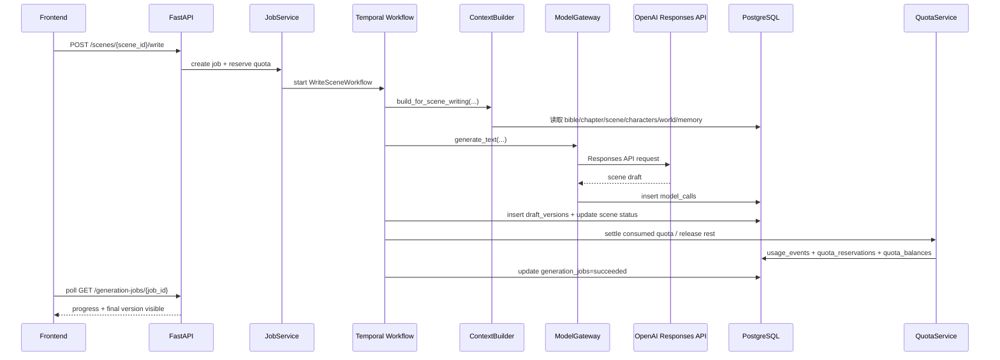

# AI 小说 SaaS 项目从前端框架走向可运行生成内核的优化报告

## 执行摘要

你的项目已经越过“纯 UI 原型”阶段，进入了一个更有价值、也更容易失控的阶段：**前端路由、后端骨架、多租户、权限、任务模型、ModelGateway 雏形、Temporal 容器、MinIO 占位、Plan/Quota/Usage 结构都已存在，但真正把这些模块串成“可运行的小说生成内核”的关键闭环还没有打通。** 当前最核心的缺口不是再补页面，而是先完成第一个真实业务闭环：**创建项目 → 启动 StoryBible 生成任务 → 生成 `generation_job` → 额度预留 → 调用 ModelGateway → 落库 `novel_specs/characters/world_items/plot_threads` → 写入 `model_calls/usage_events` → 在任务页与故事圣经页可见。** 这是项目从“壳”升级为“产品”的临界点。fileciteturn0file0turn0file2

从你现有文档看，现状并不是“缺技术栈”，而是“缺一条自上而下、可回放、可计量、可观察、可回退的生成链路”。架构文档已经明确要求以 `organization` 为租户边界、以 `scene` 为最小生成单位、以 workflow 而不是普通 HTTP 请求驱动长任务，并记录每次模型调用与额度变化；UI 文档也已经为 Studio、写作工作台、任务中心和 Admin Console 提供了足够清晰的产品骨架。换言之，你当前最需要做的不是重新设计，而是**压缩范围、冻结契约、按 StoryBible → Outline → ScenePlan → WriteScene 的顺序，逐层把 mock 变成真实闭环。** fileciteturn0file2turn0file3

本报告建议采用 **6 个 Sprint、每个 Sprint 2 周** 的推进方式。短期的 Sprint 1–3 聚焦在“生成内核的最小可运行链”；中期的 Sprint 4–6 聚焦在“写作质量、导出、可观测性、Admin 运维与向量检索增强”。开源项目的纳入策略应该采取**能力吸收而不是代码拼装**：GOAT-Storytelling-Agent 用于吸收顶层规划与场景拆分流程，GPTAuthor 用作 baseline 生成链，Author 用于吸收编辑器与世界观/快照体验，SillyTavern 用于吸收 Lorebook、插入顺序和向量召回机制。这里面，MIT 项目可以做更直接的工程改写；AGPL 项目不建议直接拷贝到闭源 SaaS 内核中。citeturn11search1turn4search0turn11search2turn11search3turn11search7turn11search4turn3search2

技术上，你的后端应尽快统一 **Pydantic/JSON Schema、API 契约、任务状态机、额度预留/结算规则、ModelGateway 的 mock→staging→prod 策略、ContextBuilder 的召回顺序与 token budget**。Temporal 在这里不是“先上再说”的装饰品，而是长任务可靠性的基础：它的 Python SDK 天生支持 Durable Execution、取消、重试、子工作流和 Continue-As-New，但这些能力要建立在 **小粒度任务、明确状态写回、受控重试策略和避免超大历史记录** 的前提下。对于模型调用，OpenAI 官方已经提供 Responses API、Structured Outputs 和明确的限流退避建议，这意味着你的 StoryBible、Outline 和审稿结果都应该优先走结构化输出而不是自由文本。citeturn8search6turn0search0turn8search2turn1search1turn8search1turn8search11turn9search0turn9search1turn1search0

## 当前基线与目标定义

### 当前项目假设

下表是基于你提供的项目进度说明、架构文档和 UI 规格整理出的当前基线。凡文档未明确给出，统一标注为“未指定”。

| 维度 | 当前判断 | 状态判断 | 主要缺口 |
|---|---|---|---|
| 前端技术栈 | Next.js App Router、React、TypeScript、Tailwind CSS、lucide-react、recharts、TanStack Query、Vitest | 已明确 | 页面壳完整，但 mock→真实 API 切换未完成 |
| 后端技术栈 | FastAPI、SQLAlchemy Async、Pydantic/Pydantic Settings、JWT、PostgreSQL + pgvector、Redis、Temporal SDK、MinIO 占位、Pytest | 已明确 | 生成闭环未完成，迁移体系待规范 |
| 多租户与权限 | `organizations`、membership、平台角色与组织角色、`X-Organization-Id`、首个用户自动 `super_admin` | 已明确 | 需要把生成链路中的每一步都强制贯穿 `organization_id` |
| 生成任务 | `generation_jobs` 已存在，任务列表/详情/取消接口已存在，整本生成入口与场景写作入口已存在 | 部分可用 | job 类型与状态、步骤写回、前后端契约需统一 |
| ModelGateway | 默认 mock，OpenAI/Anthropic provider 雏形存在，默认模型配置已写入，但生产配置与安全管理未完成 | 部分可用 | 真实调用、重试、幂等、prompt 版本记录未闭环 |
| Temporal | 容器可启动，workflow 文件存在，`TEMPORAL_ENABLED=false` 时返回 mock workflow id | 部分可用 | 真实 workflow 启动、状态回写、取消/失败/重试未闭环 |
| 对象存储 | MinIO 已有占位 | 部分可用 | 导出文件生成、上传、预签名下载链路未闭环 |
| 商业层 | Plan / Quota / Usage 数据结构与前端页面存在 | 部分可用 | 支付未接入，Quota 预留/结算逻辑需变成真实逻辑 |
| 可观测性 | 架构中规划了 OpenTelemetry、Prometheus、Grafana、Sentry | 文档已规划 | 实际接入情况未指定 |
| 实时任务状态 | UI 规格建议 SSE / WebSocket / 轮询降级 | 文档已规划 | 当前是否已实现未指定 |
| 编辑器 | 写作页三栏布局已存在 | 已明确 | 实际编辑器内核、快照、接受/拒绝 AI 输出机制未指定 |
| 路由契约 | 当前项目存在 `/studio/projects/[projectId]/export`、`/admin/generation-jobs` 等路由；UI 规格部分位置又写成 `/exports`、`/admin/jobs` | 存在命名漂移 | 必须在 Sprint 1 前冻结路由/API 命名策略 |

表内现状均来自你给出的项目进度说明、最终架构文档与 UI 规格文档。fileciteturn0file0turn0file2turn0file3

这里要特别强调一个会持续拖慢开发的隐患：**你的路由和领域命名已经出现漂移**。例如，当前项目进度说明使用 `/studio/projects/[projectId]/export` 和 `/admin/generation-jobs`，而 UI 规格文档部分章节使用 `/exports` 与 `/admin/jobs`；任务类型上，进度说明建议过 `story_bible / outline / chapter / scene / full_novel / rewrite / export`，而 mock schema 与架构又更接近 `generate_bible / generate_outline / generate_scene_plan / write_scene / export_novel` 这种风格。这个问题如果不在 Sprint 1 冻结，会直接导致前端、后端、数据表、Admin 页面、测试用例和运维脚本持续错位。fileciteturn0file0turn0file3turn0file7

### 短期与中期目标

#### 短期目标

| Sprint | 目标 | 量化验收标准 | mock→真实切换点 |
|---|---|---|---|
| Sprint 1 | StoryBible 真实闭环 | `POST /api/v1/projects/{id}/bible/generate` 返回 202；创建 1 条 `generation_jobs`；至少写入 1 条 `novel_specs`、≥2 条 `characters`、≥2 条 `world_items`、≥1 条 `plot_threads`、≥1 条 `model_calls`、≥1 条 `usage_events`；`/jobs` 与 `/bible` 页面可见 | “生成故事圣经”按钮、任务页、故事圣经页 |
| Sprint 2 | Outline 真实闭环 | `POST /api/v1/projects/{id}/outline/generate` 返回 202；`chapters` 表写入目标章节树；项目状态变为 `outline_ready`；大纲页显示真实章节树与章节详情 | 大纲页、项目总览“下一步动作” |
| Sprint 3 | ScenePlan 真实闭环 | `POST /api/v1/chapters/{id}/scenes/generate` 返回 202；单章生成 3–6 个 `scenes`；写作页左侧树显示真实 scene；`generation_jobs` 中可区分 `generate_scene_plan` | 写作页左侧章节/场景树、任务页 |

#### 中期目标

| Sprint | 目标 | 量化验收标准 | mock→真实切换点 |
|---|---|---|---|
| Sprint 4 | WriteScene 真生成 + 版本落库 | `POST /api/v1/scenes/{id}/write` 可创建 `draft_versions`；scene 状态 `planned/writing/drafted` 可见；编辑器加载真实正文；`model_calls` 与额度结算与正文版本关联 | 写作页“生成当前场景”、版本面板、模型调用摘要 |
| Sprint 5 | 审稿/重写 + 导出 | `continuity_issues` 可生成并展示；`POST /api/v1/projects/{id}/export` 创建 `export_files`；MinIO 中有对象；可用预签名 URL 下载 | 问题页、导出页、Admin 模型日志/任务对账 |
| Sprint 6 | 工作流加固 + 可观测性 + Admin 运维闭环 | 支持取消/重试；失败任务可恢复；Admin 系统设置可保存 provider/model/prompt 版本并写入审计日志；关键指标可观测 | Admin settings、Admin jobs、Admin audit logs、监控面板 |

这些目标与你现有架构对“workflow 驱动、scene 粒度、额度预留、模型调用全量记录”的要求是一致的。fileciteturn0file2turn0file3

## 优先级路线与开源纳入策略

### 优先级任务表

下表按“高 / 中 / 低优先级”给出下一阶段的实际任务排序。工时估算按 **1 名熟悉当前代码的资深全栈工程师** 计算，人日为保守估算。

| 优先级 | 任务 | 主要产出 | 预估工作量 | 风险点 | 回退策略 |
|---|---|---|---:|---|---|
| 高 | 路由/API/枚举冻结 | 统一 route、job type、status、error code | 1–2 人日 | 前后端历史命名不一致 | 保留 alias，主契约只认新枚举 |
| 高 | StoryBibleWorkflow | Bible 真实闭环 | 4–6 人日 | `novel_planner` 与 ModelGateway 参数未对齐 | 保留 `MODEL_GATEWAY_MODE=mock` |
| 高 | job 状态机标准化 | `created / quota_reserved / queued / running / succeeded / failed / cancelled` | 2–3 人日 | 历史状态值不兼容 | 兼容旧值读取，写入新值 |
| 高 | Quota 预留/结算 v1 | `quota_reservations` + settle/release | 3–4 人日 | 估算与实际消耗偏差 | 先允许 conservative over-reserve |
| 高 | ModelGateway staging/prod 接入 | mock / staging / prod 三态 | 3–5 人日 | 429/5xx/解析失败 | 降级到 mock 或小模型 staging |
| 中 | OutlineWorkflow | chapters 真实生成与落库 | 3–5 人日 | 场景和章节层级字段设计反复 | schema version + migration |
| 中 | ContextBuilder v1 | 固定顺序召回 + token budget | 4–6 人日 | 召回太多导致成本飙升 | 先只做结构化 + 最近摘要 |
| 中 | WriteSceneWorkflow | 场景正文 + draft_versions | 5–7 人日 | 内容质量不稳、版本覆盖风险 | 先只生成新版本，不覆盖旧稿 |
| 中 | 导出链路 + MinIO | Markdown/TXT 导出、预签名下载 | 3–4 人日 | 对象存储访问与 URL 暴露 | MinIO 不可用时回退本地文件 |
| 中 | Alembic 基线迁移 | 初始 revision + 规范化迁移流 | 2–3 人日 | 现有 runtime schema patch 与 migration 冲突 | 冻结 schema 后生成 baseline |
| 中 | 测试/监控基线 | API 集成测试 + job metrics + structured logs | 4–6 人日 | 测试夹具跟 schema 演进失配 | 先为 P0 流程建快照测试 |
| 低 | 向量检索 v2 | HNSW/IVFFlat、召回排序、RAG explainability | 4–6 人日 | 查询成本与 recall 不稳定 | 先只用章节/场景摘要 |
| 低 | 审稿/重写增强 | 问题结构化 + 局部重写 | 4–6 人日 | 容易演变成第二套写作器 | 只处理高严重度问题 |
| 低 | Full Novel Orchestrator | chapter child workflows + continue-as-new | 5–8 人日 | Workflow history 爆炸 | 先限制为“前 3 章生成” |

这张优先级表的核心含义是：**不要一开始就做全书生成，也不要优先做支付；先让 StoryBible 闭环成为真实能力。** 你的项目进度说明本身也已经把“接通生成故事圣经”列为 P0。fileciteturn0file0

### 开源项目纳入矩阵

| 项目 | 建议吸收模块 | 不建议直接复用的原因 | clean-room 实现建议 | 推荐落点 |
|---|---|---|---|---|
| GOAT-Storytelling-Agent | `book_spec`、章节规划、场景拆分、自上而下写作流程 | 其默认运行链路与本项目的多租户、Quota、Admin、Temporal 体系不同；直接纳入会破坏你现有服务边界 | 只吸收“生成阶段拆分”和字段设计，把每个阶段改写为你自己的 `story_bible_generator / outline_generator / scene_planner` 服务 | `backend/app/services/novel_planner/*` |
| GPTAuthor | synopsis → chapter summaries → iterative drafting 的 baseline | 太轻量，缺少长期记忆、额度、审稿、租户、Admin 对账 | 作为 baseline 工具和回归测试，不作为生产主路径 | `backend/app/tools/baselines/*` |
| Author | 富文本写作体验、世界观/设定管理、快照回滚、导入导出体验 | AGPL-3.0；若直接复用到闭源商业 SaaS，会引入许可证义务 | 只参考交互和信息架构，重做 editor/world/snapshot/export 体验 | `frontend/features/editor/*`、`frontend/features/world/*` |
| SillyTavern | World Info / Lorebook、关键词触发、插入顺序、向量召回、Data Bank 思路 | AGPL-3.0；产品形态与小说 SaaS 差异大，直接嵌入会引入 UI 与许可负担 | 吸收 Lorebook 规则与向量召回原则，重写 `ContextBuilder` | `backend/app/services/context_builder/*`、`backend/app/services/memory/*` |

GOAT README 展示了 `init_book_spec`、章节规划、场景拆分和自上而下生成的流程，非常适合作为你 StoryBible→Outline→ScenePlan 的参考；GPTAuthor README 明确它是一个用于多章节长文写作的 CLI 工具；Author README 强调专业富文本编辑器、AI 写作助手与完整世界观管理；SillyTavern 文档则把 World Info/Lorebook、插入顺序和向量化检索写得非常清晰。许可证方面，GOAT 和 GPTAuthor 为 MIT，而 Author 与 SillyTavern 为 AGPL-3.0；GNU/项目许可证文本都强调，网络服务形态下运行修改版 AGPL 软件会触发对应源代码提供义务。citeturn11search1turn4search0turn11search2turn2search1turn11search3turn11search7turn11search4turn2search6turn5search2turn5search3turn3search2turn3search14

因此，纳入策略应明确分成两类：  
**MIT 项目**（GOAT、GPTAuthor）可以作为“流程与代码参考”；  
**AGPL 项目**（Author、SillyTavern）更适合作为“产品/机制参考”，通过 clean-room 方式重写，不直接复制代码。citeturn11search1turn11search2turn11search7turn11search4

## 详细技术设计

### 数据契约与 Schema 统一

你现在最需要的是一套**跨前端、API、工作流、数据库、模型输出完全一致的 Schema**。建议在后端新增一个集中式 schema 模块，比如：

```text
backend/app/schemas/
├── generation.py
├── novel.py
├── billing.py
└── admin.py
```

并把 StoryBible、Outline、ScenePlan、GenerationJob、ModelCall、UsageEvent、Plan/Quota 全部收拢为同一版 Pydantic 契约。这样做的原因有两个：第一，当前架构已经要求所有中间结果落库、可追踪、可回滚；第二，OpenAI 的 Structured Outputs 可以直接把模型输出约束到你定义的 JSON Schema 上，减少解析失败和字段漂移。fileciteturn0file2turn0file7 citeturn9search1turn9search17

下面是一组建议的 Pydantic 示例，重点不是字段多少，而是**字段名稳定、可以直接映射表结构、可以带 schema_version**：

```python
from __future__ import annotations

from datetime import datetime
from typing import Literal

from pydantic import BaseModel, Field

class CharacterSeed(BaseModel):
    name: str
    role: Literal["protagonist", "antagonist", "supporting", "minor"]
    description: str
    motivation: str | None = None
    secret: str | None = None

class StoryBibleSchema(BaseModel):
    schema_version: str = "1.0"
    premise: str
    theme: str
    genre: str
    tone: str
    target_reader: str
    narrative_pov: str
    style_guide: str
    constraints: list[str] = Field(default_factory=list)
    world_overview: str
    core_conflict: str
    selling_points: list[str] = Field(default_factory=list)
    character_seeds: list[CharacterSeed] = Field(default_factory=list)
    world_rule_seeds: list[str] = Field(default_factory=list)

class ChapterOutlineSchema(BaseModel):
    schema_version: str = "1.0"
    chapter_index: int
    title: str
    summary: str
    goal: str
    conflict: str
    ending_hook: str
    characters: list[str] = Field(default_factory=list)
    location: str | None = None
    plot_threads: list[str] = Field(default_factory=list)
    estimated_words: int = 0
    locked_by_user: bool = False

class ScenePlanSchema(BaseModel):
    schema_version: str = "1.0"
    scene_index: int
    title: str
    time_marker: str
    location: str
    characters: list[str]
    goal: str
    conflict: str
    emotion_start: str
    emotion_end: str
    reveal: str
    hook: str
    estimated_words: int = 0

class GenerationJobSchema(BaseModel):
    id: str
    organization_id: str
    user_id: str
    project_id: str
    workflow_id: str | None = None
    job_type: Literal[
        "generate_bible",
        "generate_outline",
        "generate_scene_plan",
        "write_scene",
        "audit_scene",
        "rewrite_scene",
        "audit_chapter",
        "export_novel",
        "update_memory",
    ]
    status: Literal[
        "created",
        "quota_reserved",
        "queued",
        "running",
        "succeeded",
        "failed",
        "cancelled",
        "quota_insufficient",
        "permission_denied",
        "subscription_inactive",
        "rate_limited",
    ]
    current_step: str | None = None
    progress_percent: int = 0
    reserved_quota: int = 0
    consumed_quota: int = 0
    error_code: str | None = None
    error_message: str | None = None

class ModelCallSchema(BaseModel):
    id: str
    organization_id: str
    project_id: str | None = None
    generation_job_id: str | None = None
    task_type: str
    provider: Literal["openai", "anthropic", "mock"]
    model: str
    prompt_key: str
    prompt_version: str
    input_tokens: int = 0
    output_tokens: int = 0
    latency_ms: int = 0
    status: Literal["success", "failed"]
    request_id: str | None = None
    estimated_cost_usd: float | None = None

class UsageEventSchema(BaseModel):
    id: str
    organization_id: str
    user_id: str
    project_id: str | None = None
    generation_job_id: str | None = None
    event_type: Literal["generated_words", "review", "rewrite", "export", "manual_adjustment"]
    amount: int
    unit: Literal["words", "times", "files"]
    created_at: datetime = Field(default_factory=datetime.utcnow)

class PlanQuotaSchema(BaseModel):
    organization_id: str
    plan_code: Literal["Free", "Starter", "Pro", "Team", "Enterprise", "Internal"]
    quota_key: Literal[
        "monthly_generated_words",
        "monthly_review_count",
        "monthly_rewrite_count",
        "max_projects",
        "concurrent_jobs",
        "export_docx",
        "export_epub",
    ]
    limit_value: int
    used_value: int
    reserved_value: int
```

建议你对照现有的 `novel_specs / characters / world_items / plot_threads / chapters / scenes / generation_jobs / model_calls / usage_events / quota_*` 模型做一次字段对齐，把所有“前端显示名”和“后端持久化字段名”统一起来，避免后续 React Query key、Admin 表格、Temporal activity payload 与数据库列名三套语言并存。fileciteturn0file2turn0file7

### API 设计与错误模型

生成任务类 API 不应返回“同步结果”，应返回 **202 Accepted + job_id/workflow_id**。这是因为你的架构已经明确长任务是 workflow，不是普通 HTTP 请求，而且前端已经有任务中心页与写作页底部任务面板，天然适合消费 job 作为真实状态源。fileciteturn0file2turn0file3

建议先冻结以下 API：

```text
POST /api/v1/projects/{project_id}/bible/generate
GET  /api/v1/projects/{project_id}/bible
POST /api/v1/projects/{project_id}/outline/generate
GET  /api/v1/projects/{project_id}/chapters
POST /api/v1/chapters/{chapter_id}/scenes/generate
GET  /api/v1/chapters/{chapter_id}/scenes
POST /api/v1/scenes/{scene_id}/write
GET  /api/v1/scenes/{scene_id}/versions
GET  /api/v1/generation-jobs/{job_id}
POST /api/v1/generation-jobs/{job_id}/cancel
POST /api/v1/generation-jobs/{job_id}/retry
POST /api/v1/projects/{project_id}/export
GET  /api/v1/exports/{export_id}
```

StoryBible 的最小请求/响应建议如下：

```http
POST /api/v1/projects/{project_id}/bible/generate
Content-Type: application/json
X-Organization-Id: org_xxx
Authorization: Bearer <token>
```

```json
{
  "force_regenerate": false,
  "provider_mode": "mock",
  "notes": "根据当前项目 seed 生成故事圣经"
}
```

```json
{
  "job_id": "job_01J...",
  "workflow_id": "wf_01J...",
  "project_id": "project_01J...",
  "job_type": "generate_bible",
  "status": "queued",
  "reserved_quota": 3000,
  "message": "StoryBible generation accepted"
}
```

统一错误模型可以这样设计：

```json
{
  "code": "quota_insufficient",
  "message": "当前组织额度不足，无法启动生成任务",
  "retryable": false,
  "context": {
    "quota_key": "monthly_generated_words",
    "required": 3000,
    "remaining": 1200
  }
}
```

HTTP 状态建议采用下面这组规则：  
`202` 用于长任务已接受；  
`400/422` 用于参数与 schema 错误；  
`403` 用于权限不足；  
`404` 用于对象不存在或不属于当前组织；  
`409` 用于状态冲突、并发冲突、套餐不允许、额度不足等业务性拒绝；  
`429` 留给平台速率限制或供应商限流。  
这组约定能让前端的 toast、ConfirmDialog、QuotaGuard 和 PermissionGate 都更容易实现一致行为。fileciteturn0file3 citeturn1search7turn1search0

### 工作流编排

#### StoryBibleWorkflow

```mermaid
flowchart TD
    A[前端点击 生成故事圣经] --> B[POST /projects/{id}/bible/generate]
    B --> C[认证 租户解析 权限校验]
    C --> D{套餐 额度 并发 是否允许}
    D -- 否 --> E[返回 409/403 domain error]
    D -- 是 --> F[创建 generation_job]
    F --> G[创建 quota_reservation]
    G --> H[启动 Temporal workflow 或内部 worker]
    H --> I[ModelGateway.generate_json]
    I --> J[StoryBibleSchema 校验]
    J --> K[保存 novel_specs]
    K --> L[保存 characters world_items plot_threads]
    L --> M[保存 model_calls]
    M --> N[写入 usage_events]
    N --> O[结算或释放额度]
    O --> P[更新 project / job 状态]
    P --> Q[前端 /jobs 与 /bible 页面可见]
```

这个工作流的设计重点不是“调用一次模型”，而是把**任务记录、额度记录、模型调用、业务结果、失败原因**全部串进同一条可恢复链路里。Temporal 的价值在于 Durable Execution、Activity Retry、Cancellation 和 Child Workflow 能力；但对你的前端而言，**`generation_jobs` 表才是事实来源**，Temporal 只负责执行与恢复，不应直接暴露给 Web UI。Temporal 官方文档明确支持取消、重试策略、子工作流、消息处理和 Continue-As-New；同时也明确了 Workflow 的 Event History 会随着事件不断累积，在 10,240 个事件后告警、超过 51,200 个事件后终止，所以整书级工作流必须尽早拆成 chapter/scene 级 child workflows，而不是把一切塞进一个父工作流里。citeturn8search6turn0search0turn8search2turn1search1turn1search8turn8search1turn8search11

#### WriteSceneWorkflow



对于 WriteSceneWorkflow，我建议你按 **Scene → DraftVersion → AuditIssue → RewriteCandidate** 的链路保存，而不是“场景只有一份正文”。这样才能支持 UI 规格中已经定义好的版本面板、审稿问题、重写与回滚。架构文档也明确要求保存 scene 级版本、审稿 JSON 和连续性问题。fileciteturn0file2turn0file3

### ModelGateway 设计

你当前已经有一个 mock-first 的 ModelGateway，这其实是优势，因为它天然适合做三阶段接入：

| 模式 | 用途 | 推荐行为 |
|---|---|---|
| mock | 本地 UI 联调、API 合同开发、可重复测试 | 按 `task_type + seed + input_hash` 返回稳定伪造 JSON / 文本 |
| staging | 预发布环境真实供应商调用 | 使用较低成本模型、小配额、完整日志与失败对账 |
| prod | 正式环境 | 使用 Admin 配置下发的 provider/model/prompt version，启用重试、限流、审计 |

这个设计应该落实到 `backend/app/services/model_gateway/service.py` 的配置与 provider 选择中，不要再把模型名、strict JSON 行为、token 预算写死在具体 workflow 里。OpenAI 官方当前将 Responses API 作为更统一的文本/结构化/工具接口；Structured Outputs 则可以确保模型输出严格遵循 JSON Schema；同时官方也明确建议对限流错误使用随机指数退避。基于这些官方能力，你的 `generate_json()` 最合理的实现方式就是：**先选择 provider/model → 渲染 prompt template → 调用 Responses API → 以 strict JSON Schema 校验 → 写入 `model_calls` → 返回结构化对象。** citeturn9search0turn9search1turn9search22turn1search0

建议再补以下四个能力：

1. **幂等键**：`dedupe_key = hash(organization_id, project_id, job_type, target_id, canonical_input)`。如果相同任务在短时间内重复提交，直接返回已有进行中 job，避免重复消费额度。  
2. **重试分层**：  
   - 429 / 5xx / 网络错误：自动指数退避 2–3 次。  
   - 4xx 参数/鉴权/模型不支持：直接失败，不重试。  
   - JSON 校验失败：允许一次 repair pass，仍失败则 job failed。  
3. **Prompt 版本化**：把 `prompt_key / prompt_version / rendered_system_prompt / rendered_user_prompt / schema_version` 全量记录到 `model_calls`。  
4. **成本与 token 预算**：即便第一阶段先不做精确美元成本，也应先记录输入/输出 token 和估算成本列。  

这些都与你架构文档中“每次模型调用必须记录输入、输出、token、耗时、错误、任务归属”和“Prompt 要做可版本化模板系统”的要求一致。fileciteturn0file2

### ContextBuilder 设计

长篇小说生成是否稳定，决定因素往往不是模型句子能力，而是 **ContextBuilder 是否可控**。SillyTavern 的 World Info 与 Data Bank 文档之所以值得参考，正是因为它把“什么内容按什么顺序插入 prompt、什么时候触发关键词召回、如何结合向量检索”讲清楚了。你的系统可以借鉴这个思想，但必须以“写小说工作流”的需求做重写。citeturn2search6turn5search2turn5search3

建议把写场景时的上下文插入顺序固定成下面这套：

1. **硬约束**：故事圣经、禁忌内容、风格规则、叙事视角。  
2. **当前任务上下文**：当前章节大纲、当前 scene plan。  
3. **相关人物状态**：人物卡简版 + 当前状态。  
4. **相关世界观硬规则**：地点、组织、能力体系、不可违反规则。  
5. **主线/支线/伏笔**：与当前 chapter/scene 相关的 plot threads。  
6. **最近摘要**：前 1–3 个 scenes 摘要 + 上一章摘要。  
7. **向量召回**：从 `memory_entries` 中取 top-k。  
8. **可选补充记忆**：历史相似场景、风格示例。  

在实现上，建议 `ContextBuilder` 至少区分 **trusted context** 与 **untrusted retrieved context**。这是因为一旦你开始从向量库或用户可编辑 Lorebook 中召回文本，就会进入 prompt injection 风险域。OpenAI 的安全文档把 prompt injection 视为常见且危险的攻击类型，并明确建议通过系统设计将风险影响约束住，而不是假设模型永远能识别恶意上下文。因此，你应当把“故事圣经、平台规则、禁忌内容”作为不可被召回内容覆盖的高优先级上下文，并对召回内容增加来源标记和最大预算。citeturn10search2turn10search5

一个可执行的 token budget 起步方案可以是：

| 段落 | 建议预算占比 |
|---|---:|
| 硬约束与任务上下文 | 40% |
| 人物/世界观/剧情结构 | 25% |
| 最近摘要 | 20% |
| 向量召回记忆 | 15% |

如果当前项目还未大规模积累 `memory_entries`，Sprint 3–4 完全可以先使用“结构化记忆 + 最近摘要”作为 ContextBuilder v1，把向量召回推迟到 v2。这样能显著减少不可控因素。你已经拥有 PostgreSQL + pgvector，后续可以在 `memory_entries.embedding` 上先做 HNSW 索引；pgvector README 也明确给出了 HNSW/IVFFlat 的权衡与 `m`、`ef_construction` 等参数。fileciteturn0file0 citeturn7search20turn0search2

### Quota 与 Entitlement 预留结算

额度系统不应该等支付接完才做。因为对你的平台来说，**额度结算是生成内核的一部分，不是纯商业逻辑**。当前架构已经明确采用 reservation → execution → settle/release 的模型，这非常正确。fileciteturn0file2

建议把流程固定成：

1. API 层估算任务所需额度。  
2. 检查 `plan_features / quota_balances / concurrent_jobs`。  
3. 创建 `quota_reservations(status="reserved")`。  
4. 启动 workflow。  
5. Activity 或 ModelGateway 在关键步骤写 `usage_events`。  
6. 任务成功后 `consumed_amount = actual`，释放剩余额度。  
7. 任务失败/取消时释放未消耗额度，保留最小必要消耗。  

在 UI 上，要把三类数字分开展示：  
**limit / used / reserved**。  
这样用户在任务页和 billing/usage 页面中看到的是同一套事实，而不是两套算法。你现有 UI 规格已经为 QuotaMeter、Usage、任务中心和管理员额度管理页预留了展示位，所以不需要重新设计，只需把真实值接进去。fileciteturn0file3turn0file7

### 数据库与索引建议

你现有表设计已经很丰富，但要从“能存”进化到“能跑快、能查准、能运维”，至少还需要补四类索引与若干列。

建议增加或确认以下列：

| 表 | 建议新增/确认列 | 用途 |
|---|---|---|
| `generation_jobs` | `workflow_id`, `dedupe_key`, `current_step`, `progress_percent`, `error_code`, `retry_count` | 任务编排与前端展示 |
| `model_calls` | `provider`, `request_id`, `estimated_cost_usd`, `schema_version`, `metadata` | 供应商对账与故障排查 |
| `quota_reservations` | `expires_at`, `released_amount` | 防僵尸预留 |
| `draft_versions` | `source`(`ai/user/rewrite`), `parent_version_id`, `is_final` | 版本链与导出来源 |
| `memory_entries` | `memory_type`, `importance`, `embedding` | ContextBuilder 与向量召回 |
| `prompt_templates` | `prompt_key`, `version`, `status`, `output_schema`, `provider_constraints` | Prompt 管理 |

建议增加或确认以下索引：

| 表 | 索引建议 | 说明 |
|---|---|---|
| `projects` | `(organization_id, status, updated_at desc)` | Studio 项目列表 |
| `generation_jobs` | `(organization_id, project_id, created_at desc)`、`(organization_id, status, created_at desc)` | 项目任务页与 Admin 任务页 |
| `generation_jobs` | **partial index** on active jobs where `status in ('queued','running')` | 并发检查与任务列表 |
| `model_calls` | `(organization_id, project_id, generation_job_id, created_at desc)` | 任务 drill-down |
| `usage_events` | `(organization_id, created_at desc)`、`(project_id, event_type, created_at desc)` | 账单与项目视角 |
| `quota_balances` | unique `(organization_id, quota_key, period_start, period_end)` | 周期唯一约束 |
| `quota_reservations` | `(organization_id, status, expires_at)` | 清理保留与额度恢复 |
| `memory_entries` | HNSW on `embedding` | 语义召回 |
| JSONB 字段 | 只对高频查询键做 GIN / expression / partial indexes | 避免“全列 GIN”式过度索引 |

PostgreSQL 官方明确支持 partial indexes，`jsonb` 也支持 GIN/operator class 索引；pgvector 官方 README 则给出了 HNSW/IVFFlat 的推荐与参数说明。对于你的场景，**`organization_id` 应当几乎总是作为复合索引前缀**，否则多租户查询和后台筛选会很快变慢。citeturn6search1turn7search5turn7search1turn7search20

此外，SQLAlchemy Async 与 Alembic 也应尽快正规化。SQLAlchemy 官方 asyncio 文档建议使用 `create_async_engine()` 与异步上下文管理事务；Alembic 官方文档则说明 migration environment 应作为应用代码的一部分维护，`--autogenerate` 生成的是 candidate migrations，不是“盲目直接上线的真相”。这对你当前“运行时 schema 修复”阶段尤其重要。citeturn7search0turn7search11turn1search2turn1search13

## 前端集成、测试与监控

### 前端集成建议

你的前端已经拥有完整的路由骨架、Studio 与 Admin 分离布局、权限可见性规则和写作工作台三栏结构；因此下一阶段的前端重点不是“重写页面”，而是把真实 API 接口以最小冲击方式挂进去。最安全的方式是：**保持页面组件结构不变，把所有数据入口统一收口到现有 `frontend/lib/http.ts` 与 `frontend/lib/api.ts`，让 TanStack Query 的 query keys 和页面 props 继续沿用原形，只替换数据源。** 项目进度说明里已经把这些文件作为后续 Codex/工程阅读入口列出来了，这说明你的前端分层方向是对的。fileciteturn0file0

建议按下面顺序切换页面：

| 优先级 | 页面 | 先接入什么真实能力 | 验收点 |
|---|---|---|---|
| P0 | `/studio/projects/[id]/bible` | `POST/GET bible` | 生成按钮触发真实任务；页面能显示真实 Bible |
| P0 | `/studio/projects/[id]/jobs` | `GET job detail/list` | job 状态、步骤、额度、错误、model call 摘要可见 |
| P0 | `/studio/projects/[id]` | 项目状态与下一步动作 | Overview 能读到真实 project status 与 job 摘要 |
| P1 | `/studio/projects/[id]/outline` | chapters 真实树 | 大纲页显示真实章节 |
| P1 | `/studio/projects/[id]/write` | scenes + draft_versions + write_scene | 左树、编辑器、底部任务面板接真实数据 |
| P1 | `/studio/usage` / `/studio/billing` | quotas + usage_events | 用户看到真实额度消耗 |
| P1 | `/admin/generation-jobs` / `/admin/model-calls` | 平台级任务和模型日志 | Admin 可以排障与对账 |

如果你需要一个**mock→真实切换总开关**，可以在前端引入 `NEXT_PUBLIC_API_MODE=mock|real`，但页面组件本身不要感知这个开关，保持切换只发生在 API adapter 层。这样才能做到：本地 UI 联调仍可走 mock；staging/production 走真实 API。fileciteturn0file3turn0file6

### 写作页与编辑器 UX

如果当前编辑器内核尚未最终确定，建议优先采用 **Tiptap**。它是 headless editor，基于 ProseMirror，足够灵活，适合你这种需要把“正文、版本、AI 生成、接受/拒绝输出、上下文侧栏、底部任务面板”并排拼装到一起的工作台。你的 UI 规格已经不是聊天室，而是标准的“树 + 编辑器 + 右侧 Inspector + 底部 Jobs/Versions/ModelCalls”控制台，这种布局非常适合 headless editor。fileciteturn0file3 citeturn0search11

写作页的 UX 建议先实现这五个确定性能力，再考虑复杂协作：

1. **自动保存**：每 10–20 秒自动保存当前正文到临时版本。  
2. **显式版本保存**：点击“保存版本”生成 `draft_versions` 新记录。  
3. **AI 输出接受/拒绝**：不要让 AI 直接覆盖当前正文，而是生成一个候选版本或 diff。  
4. **重生成前快照**：任何“重写当前场景 / 重新生成”动作前先创建父版本快照。  
5. **上下文可解释性**：右侧 Inspector 至少显示“本次生成用了哪些人物状态、世界观条目和记忆摘要”。  

这五点能直接把你和很多“一键生成大文本”的写作工具区别开：你不是只让模型吐文本，而是在做**可回看、可解释、可回滚**的小说生产线。fileciteturn0file2turn0file3

### 测试、监控与质量保障

你的项目已经明确前端使用 Vitest、后端使用 Pytest，所以最自然的路径不是再引入新测试栈，而是把测试按照“Schema → Service → API → Journey”分层铺开。fileciteturn0file0

建议的测试矩阵如下：

| 层级 | 必测对象 | 通过标准 |
|---|---|---|
| 单元测试 | Pydantic Schema、prompt render、quota estimate/settle、ContextBuilder 排序、状态机转换 | 枚举、必填字段、状态转换全部断言通过 |
| 服务集成测试 | `generate_bible`, `generate_outline`, `write_scene` | 创建 job 后，相关业务表和日志表都被写入 |
| API 集成测试 | 认证、租户隔离、权限隔离、错误码返回 | 非本组织项目不可访问；额度不足返回预期 domain error |
| 浏览器流程测试 | 创建项目 → 生成 Bible → 查看 Jobs → 查看 Bible | UI 可见性与状态变化正确 |
| 质量回归测试 | 固定 5–10 个 story seeds，比较结构/长度/字段完整性 | 输出必须通过 schema，关键字段不为空，不发生明显字段漂移 |

其中最重要的不是“写多少测试”，而是一定要在 Sprint 1 就建立下面这条**闭环测试断言**：

> 调用 `POST /projects/{id}/bible/generate` 后，`generation_jobs`, `quota_reservations`, `novel_specs`, `characters`, `world_items`, `plot_threads`, `model_calls`, `usage_events` 至少各有一条与该 job 关联的记录。

只要这条断言写出来，很多“看起来工作了其实没落库”的假闭环会立即暴露。fileciteturn0file2turn0file0

监控上，建议你至少从 Sprint 2 开始暴露这些指标：

| 指标类别 | 建议指标 |
|---|---|
| API | `api_request_duration_ms`, `api_error_rate` |
| Jobs | `jobs_created_total`, `job_success_rate`, `job_queue_wait_seconds`, `job_retry_total`, `job_cancel_total` |
| ModelGateway | `model_call_latency_ms_p95`, `input_tokens_total`, `output_tokens_total`, `model_call_failed_total`, `cost_estimated_usd_total` |
| Quota | `quota_reserved_total`, `quota_consumed_total`, `quota_released_total`, `quota_insufficient_total` |
| Writing | `scene_write_seconds`, `scene_word_count`, `draft_version_created_total` |
| Memory | `context_builder_hits_total`, `context_builder_prompt_tokens`, `memory_recall_topk` |

架构文档已经把 `model_calls`、`audit_logs`、业务日志与监控视为平台必备能力；OpenAI 也提供免费的 Moderation API 和安全最佳实践，适合在内容审核与后台运营环节接入。对于对象导出，MinIO Python SDK 支持 S3-compatible SDK 与预签名 GET URL，这意味着导出中心最合理的后端实现方式不是“直接返回大文件”，而是“生成对象 → 存 MinIO → 返回受限时效下载地址”。fileciteturn0file2 citeturn12search0turn12search1turn6search0turn6search4

## 六个 Sprint 计划

下面给出一个可执行的 6 Sprint 计划。假设每个 Sprint 为 2 周，团队配置为 **1 名熟悉现有代码的全栈工程师 + 1 名兼职 QA/产品负责人**。

| Sprint | 核心目标 | 后端交付物 | 前端交付物 | 验收标准 |
|---|---|---|---|---|
| Sprint 1 | StoryBible 最小真实闭环 | 冻结 job/status/API 命名；新增 `StoryBibleSchema`；实现 `POST /projects/{id}/bible/generate`；写入 `generation_jobs`、`quota_reservations`、`novel_specs`、`characters`、`world_items`、`plot_threads`、`model_calls`、`usage_events` | Bible 页按钮改真实请求；Jobs 页可看到 job；Project Overview 能看到 Bible 进度 | 真实点击一次可完成最小闭环；失败链路可见 |
| Sprint 2 | Outline 真实闭环 | `GenerateOutlineWorkflow`；`chapters` 落库；项目状态流转 `bible_ready → outline_ready`；Alembic baseline 起步 | Outline 页显示真实章节树；Overview 的“下一步动作”真实驱动 | 一个项目可生成完整章节树；Admin/Studio 都能看到任务 |
| Sprint 3 | ScenePlan 与 ContextBuilder v1 | `POST /chapters/{id}/scenes/generate`；`scenes` 落库；ContextBuilder 先接结构化上下文与最近摘要；memory 基础表写入 | Write 页左树接真实 chapters/scenes；右侧 Inspector 显示召回内容 | 单章可拆成 3–6 scenes；写作页显示真实 scene |
| Sprint 4 | WriteScene 真正文与版本系统 | `WriteSceneWorkflow`；`draft_versions` 落库；scene 状态流转；ModelGateway 三态；quota settle/release 完整 | “生成当前场景”接真实；版本面板、模型调用摘要、用量提示接真实 | scene 写作闭环完成；正文可查看与回滚 |
| Sprint 5 | 审稿/导出/MinIO | `audit_scene` / `audit_chapter` 生成 `continuity_issues`；Markdown/TXT 导出；MinIO 上传与预签名下载 | Issues 页、Export 页接真实；导出历史可下载 | 问题与导出链都真实可用 |
| Sprint 6 | 工作流与运营加固 | Child workflows、取消/重试、continue-as-new 预案、Admin 设置保存、审计日志、关键指标暴露、向量检索 v2 | Admin settings、Admin jobs、Admin model calls、Admin audit logs 打通；Usage/Billing 页面显示真实数字 | 平台运维闭环可用；P0 旅程稳定 |

这个计划与架构文档中“阶段 3 小说生成内核 → 阶段 4 Workflow/Worker → 阶段 5 质量系统 → 阶段 7 后台运营”的顺序基本一致，只是把最前面的 StoryBible 闭环进一步压缩为最小、可演示、可回归测试的落地点。fileciteturn0file2turn0file0

## 风险与缓解

| 风险类型 | 风险描述 | 影响 | 缓解措施 |
|---|---|---|---|
| 技术 | Workflow history 过大，整书级任务在 Temporal 中膨胀 | 任务变慢、失败、不可恢复 | chapter child workflows；scene 粒度；必要时 continue-as-new |
| 技术 | 模型输出与 DB schema 漂移 | 落库失败、前端字段错位 | Structured Outputs + schema_version + validation repair pass |
| 技术 | 供应商限流、超时、5xx | job 卡死或频繁失败 | ModelGateway 层指数退避；Activity retry policy；分 provider mode |
| 技术 | `route / enum / status` 命名漂移 | 前后端长期错位 | Sprint 1 冻结契约；保留 alias 兼容旧值 |
| 技术 | 运行时 schema patch 与真实迁移冲突 | 线上 schema 不可预期 | Alembic baseline；禁止生产自动补表 |
| 数据/质量 | 长文上下文失真、记忆污染 | 正文质量下降、连续性崩坏 | ContextBuilder 分层；先结构化记忆，后向量召回 |
| 安全 | 检索到的 Lorebook / memory 文本触发 prompt injection | 模型行为异常、可能错误调用工具 | trusted vs untrusted context；召回内容限额；审计与来源标识 |
| 合规 | 直接复制 AGPL 项目代码进入闭源 SaaS | 许可证风险 | Author/SillyTavern 只参考，不复制；clean-room 实现 |
| 商业 | 支付未接入时额度规则与套餐承诺不一致 | 定价/客户预期失真 | 支付前用后台手动套餐开通 + 明确 beta 策略 |
| 安全/内容 | 生成内容违规或被滥用 | 平台风险、账号风险 | 接入 Moderation API；Admin content-review；审计日志 |

Temporal 官方对 Cancel、Retry Policy、Child Workflows、Continue-As-New 和 Event History 限制都给出了明确机制；OpenAI 官方则把 Structured Outputs、限流退避、Moderation 和 prompt injection 防护都放进了生产指南中。Author 与 SillyTavern 的 AGPL 许可证文本以及 GNU 的 AGPL 说明，也明确提示网络服务场景下的源码开放义务。citeturn0search0turn8search2turn1search1turn8search1turn8search11turn9search1turn1search0turn12search0turn10search2turn10search5turn11search7turn11search4turn3search2

## 七天行动清单

| 天数 | 直接动作 | 具体落点 | 交付物 | 完成判定 |
|---|---|---|---|---|
| 第一天 | 冻结契约 | 统一路由、job type、status、error code、export 命名；写一页 `docs/api_contract_v1.md` | 契约文档 + 代码 enum 常量 | 前后端不再出现 `export/exports`、`jobs/generation-jobs` 漂移 |
| 第二天 | 新增核心 Schema | `backend/app/schemas/generation.py`、`novel.py`；补 `workflow_id/current_step/progress_percent` 等列设计 | StoryBible/ChapterOutline/ScenePlan/GenerationJob/ModelCall/UsageEvent Schema | Schema 导入可用，测试通过 |
| 第三天 | 实现 Bible 启动 API 最小版 | `POST /api/v1/projects/{id}/bible/generate`；创建 `generation_jobs` + `quota_reservations` | 返回 202 + `job_id/workflow_id` | 调接口能落一条 job |
| 第四天 | 打通 mock ModelGateway + novel planner | `backend/app/services/model_gateway/service.py` 与 `novel_planner` 对齐；返回稳定 StoryBible JSON | Bible mock 输出可验证并持久化 | `novel_specs/characters/world_items/plot_threads` 均有数据 |
| 第五天 | 打通 job 状态与日志 | `queued → running → succeeded/failed`；写 `model_calls`、`usage_events`；支持失败时写 `error_code/message` | Jobs 真实可查 | `GET /generation-jobs/{job_id}` 可展示进度与错误 |
| 第六天 | 接前端 Bible 与 Jobs | 把 Bible 页按钮与 Jobs 页从 mock 改成真实 API/轮询；保留 fallback toast | 前端真实可见 | 点击按钮后，Bible 页与 Jobs 页都出现真实数据 |
| 第七天 | 补测试、迁移、演示脚本 | Pytest 集成测试至少覆盖 Bible 闭环；生成 Alembic baseline；写 demo runbook | `tests/test_generate_bible_flow.py` + migration + 演示文档 | 从空项目到 Bible 生成可一键演示 |

这七天计划故意不包含支付、全书生成、复杂审稿和高级向量检索，因为它们都应建立在 **StoryBible 首闭环已经稳定** 的前提上。只要这七天完成，你的项目就会从“有壳的 AI 小说 SaaS”升级为“有第一条真实生产链路的 AI 小说 SaaS”，之后所有优化都将变得更可验证、更可规划。